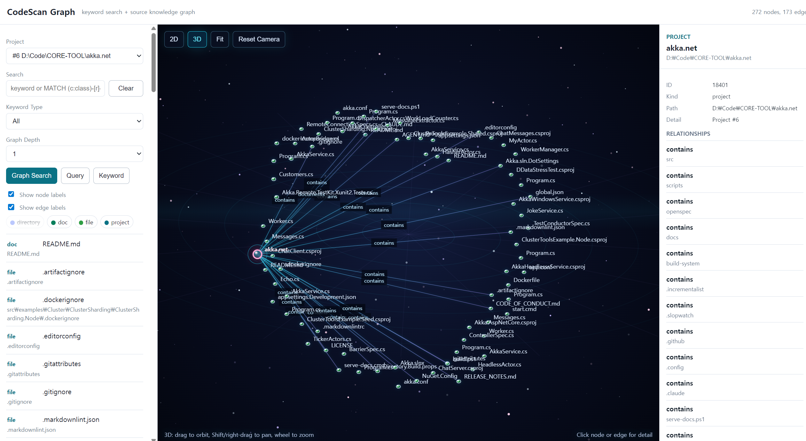

# CodeScan

A fast CLI/TUI/GUI code scanner and indexer that analyzes source code at the class:method level with git blame integration, stores results in a local SQLite database with full-text and graph search, and provides command-line, terminal, and local web interfaces.

Built as a single native AOT binary with .NET 10.0.

<p align="center">
  
</p>

## Features

- **Multi-language analysis** — Extracts classes, methods, comments, and dependency hints across common source languages
- **Git blame integration** — Associates each method with its last author, date, and commit
- **Full-text search** — FTS5 with trigram tokenizer for substring and CJK language support
- **Hybrid search** — Combines indexed DB search with live `git log --grep` results
- **Graph search** — Neo4j-style source knowledge graph stored in embedded SQLite
- **Cypher-like graph query** — Safe `MATCH ... WHERE ... LIMIT ...` subset for structured graph retrieval
- **Hybrid dependency graphing** — Regex-first dependency edges, with language/project metadata probes for future semantic analyzers
- **Interactive TUI** — Terminal.Gui v2 interface for browsing, scanning, keyword search, graph search, and graph query
- **Local web GUI** — Keyword search, graph search/query, interactive 2D graph exploration, and controllable 3D view on port 8085 by default
- **Project management** — Register, describe, update, and delete indexed projects
- **Single binary** — Native AOT compiled, no runtime dependency required

## Screenshots

### Web GUI Graph Viewer

The local GUI provides keyword search, graph search, node/edge detail inspection, 2D graph controls, and a camera-controlled 3D graph view.



### Terminal UI

The TUI supports project browsing, scanning, project management, keyword search, and graph search from the terminal.


### TUI Scan Flow

Scanning can be launched from the terminal interface with method/comment extraction, git blame enrichment, and DB graph indexing.


## Supported Languages

| Language | Extensions | Class / Type Detection | Method Detection | Dependency Hints |
|----------|-----------|------------------------|------------------|------------------|
| C# | `.cs` | class / struct / record / interface | access + return + name | using, inheritance/interface, `new`, type usage |
| Java | `.java` | class / interface / enum | access + return + name | import, extends/implements, `new`, type usage |
| Kotlin | `.kt`, `.kts` | class / object / data class / sealed class | fun / suspend fun | import, base type, constructor/type usage |
| JavaScript | `.js`, `.jsx` | class | function / arrow / const / export | import, extends/implements-style hints, `new`, type-like usage |
| TypeScript | `.ts`, `.tsx` | class | function / arrow / const / export | import, extends/implements, `new`, type annotations |
| PHP | `.php` | class / interface / trait | function | use, extends/implements, `new`, type hints |
| Python | `.py` | class (indent-based) | def / async def (indent-based) | import, base class, constructor-like calls |
| Go | `.go` | type struct/interface | graph dependency scan only | import, constructor/type usage |
| Rust | `.rs` | struct / enum / trait | graph dependency scan only | use, associated constructor/type usage |
| C/C++ | `.c`, `.cc`, `.cpp`, `.cxx`, `.h`, `.hpp`, `.hh`, `.hxx` | class / struct | graph dependency scan only | include, inheritance, `new`, type usage |

## Installation

### Platform Status

CodeScan is currently tested first on Windows PowerShell. macOS/Linux-compatible CLI usage and skill command wrappers are being prepared.

On Linux-like environments, CodeScan can currently be used by building directly from source with the .NET SDK.

### Prerequisites

- [.NET 10.0 SDK](https://dotnet.microsoft.com/) (for building)
- Git (for blame integration)

### Build from source

```bash
dotnet build
```

### Publish as single binary (AOT)

```bash
dotnet publish -c Release
```

Output: `bin/Release/net10.0/<rid>/codescan` (or `codescan.exe` on Windows)

### Deploy scripts

- **Windows:** `Script/deploy-win.ps1`
- **Linux:** `Script/deploy-linux.sh`

## Usage

### Quick Start

```bash
# Scan current directory (register + analyze + display)
codescan scan

# Scan a specific path
codescan scan /path/to/project

# Search across all indexed projects
codescan search "HttpClient"

# Graph search
codescan graph "HttpClient"
codescan search "HttpClient" --graph --depth 2

# Cypher-like graph query
codescan query "MATCH (c:class)-[r:uses_type]->(t:type) WHERE t.label = 'HttpClient'"

# Launch interactive TUI
codescan tui

# Start local GUI viewer
codescan gui start --port 8085
```

### CLI Commands

| Command | Description |
|---------|-------------|
| `scan [path]` | Register and analyze a directory (shortcut for list with defaults) |
| `list <path>` | Scan with custom filtering and output options |
| `search <query>` | Hybrid full-text + git log search |
| `graph [query]` | Search and inspect source knowledge graph |
| `query <graph-query>` | Run the CodeScan Cypher-like graph query subset |
| `cypher <graph-query>` | Alias for `query` |
| `gui start|stop` | Start or stop the local web GUI viewer |
| `projects` | List all registered projects with stats |
| `project <id>` | Show project summary or `--detail` for full view |
| `project-addinfo <id> <text>` | Add an AI-friendly description to a project |
| `project-update <id>` | Update project path or description |
| `project-delete <id>` | Remove a project from the database |
| `tui` | Launch interactive terminal UI |
| `help [command]` | Show help for a specific command |

### Search Options

```bash
# Search methods
codescan search "async" --type method

# Search comments
codescan search "TODO" --type comment

# Search within a specific project
codescan search "config" --project 1

# Search the graph
codescan search "HttpClient" --graph --depth 2
codescan graph "SearchCommand" --project 1

# Treat a search argument as a graph query
codescan search "MATCH (f:file)-[r:imports]->(m:module) LIMIT 20" --query
```

### Graph Query

CodeScan supports a Cypher-like query subset for the graph data it actually stores. It is designed for CLI users, AI agents, and automation scripts that need structured graph retrieval without direct SQL access.

This is not full Cypher. It maps to CodeScan's SQLite-backed source graph and returns a `GraphData` result that CLI, TUI, and GUI can render.

Supported patterns:

```cypher
MATCH (n:kind)
MATCH (a:kind)-[r:edge_kind]->(b:kind)
```

Supported `WHERE` fields:

| Alias Type | Fields |
|------------|--------|
| Node aliases | `kind`, `label`, `path`, `detail` |
| Edge aliases | `kind`, `label` |

Supported operators:

| Operator | Example |
|----------|---------|
| `=` | `t.label = 'HttpClient'` |
| `CONTAINS` | `c.label CONTAINS 'Command'` |
| `STARTS WITH` | `m.label STARTS WITH 'System'` |
| `ENDS WITH` | `f.path ENDS WITH '.cs'` |

Supported clauses:

| Clause | Behavior |
|--------|----------|
| `WHERE ... AND ...` | Filters matched nodes/edges |
| `RETURN ...` | Accepted for readability, ignored by the renderer |
| `LIMIT <n>` | Limits matched seed nodes/edges |

Examples:

```bash
# Find class nodes
codescan query "MATCH (c:class) WHERE c.label CONTAINS 'Service' LIMIT 20"

# Find classes that use a type
codescan query "MATCH (c:class)-[r:uses_type]->(t:type) WHERE t.label = 'HttpClient'"

# Find file imports
codescan query "MATCH (f:file)-[r:imports]->(m:module) WHERE m.label CONTAINS 'System.Net'"

# Find author-to-method relationships and expand one neighbor hop
codescan query "MATCH (a:author)-[r:authored]->(m:method) WHERE a.label CONTAINS 'kim'" --depth 1

# `graph` auto-detects MATCH queries
codescan graph "MATCH (c:class)-[r:creates]->(t:type) LIMIT 30"
```

Common node kinds:

`project`, `directory`, `file`, `class`, `method`, `comment`, `doc`, `author`, `type`, `module`

Common edge kinds:

`contains`, `defines`, `authored`, `has_comment`, `documents`, `imports`, `inherits_or_implements`, `creates`, `uses_type`

### GUI

```bash
# Start on the default port
codescan gui start

# Start on a custom port
codescan gui start --port 8090

# Stop the GUI server
codescan gui stop
```

Open `http://127.0.0.1:8085/` after starting the GUI. The viewer provides keyword search, graph search, Cypher-like graph query, a Neo4jClient-like 2D graph canvas, and a controllable 3D graph view.

GUI graph controls:

| Control | Behavior |
|---------|----------|
| `Keyword` | Run full-text keyword search |
| `Graph Search` | Search graph nodes by keyword and expand neighbors |
| `Query` | Run `MATCH ...` graph query and render the result |
| 2D drag background | Pan the graph |
| 2D mouse wheel | Zoom around the cursor |
| 2D drag node | Reposition a node |
| Node click | Show node detail and visible relationships |
| Edge click | Show relationship detail |
| Legend chips | Toggle node kinds on/off |
| `Fit` | Fit visible nodes into the canvas |
| `Reset Camera` | Reset 2D viewport or 3D camera |
| 3D drag | Orbit camera |
| 3D Shift-drag / right-drag | Pan camera |
| 3D mouse wheel | Zoom camera |

### List Options

```bash
# Tree view with method details
codescan list /path/to/project --detail --tree

# Filter by extension
codescan list /path --include .ts,.tsx

# Limit depth and include git blame
codescan list /path --depth 3 --blame
```

## Data Storage

All data is stored under `~/.codescan/`:

```
~/.codescan/
├── db/
│   └── codescan.db      # SQLite database with FTS5 index
└── logs/
    └── *.log            # Scan logs (--devmode only)
```

### Database Tables

| Table | Contents |
|-------|----------|
| `projects` | Indexed projects with path, scan date, stats |
| `scans` | Scan history per project |
| `files` | File metadata (path, size, extension, depth) |
| `methods` | Class:method definitions with git blame data |
| `comments` | Comment blocks with surrounding code context |
| `project_docs` | Auto-discovered README / AGENT / CLAUDE.md content |
| `search_index` | FTS5 virtual table (trigram tokenizer) |
| `graph_nodes` | Source graph nodes: projects, directories, files, classes, methods, comments, docs, authors |
| `graph_edges` | Source graph relationships: contains, defines, authored, documents, comments, imports, creates, uses_type, inherits_or_implements |

### Graph Edge Rules

Structural edges:

| Edge | Meaning |
|------|---------|
| `project -[contains]-> directory/file` | Project file tree |
| `directory -[contains]-> directory/file` | Directory file tree |
| `file -[contains]-> class` | Class/type found in a source file |
| `class/file -[defines]-> method` | Method/function definition |
| `file -[has_comment]-> comment` | Comment block found in a source file |
| `author -[authored]-> method` | Git blame last-author relationship |
| `project -[documents]-> doc` | Auto-discovered project document |

Dependency hint edges:

| Edge | Source |
|------|--------|
| `file/class -[imports]-> module` | `using`, `import`, `use`, `#include` |
| `class -[inherits_or_implements]-> type` | Base class / interface / trait-style declarations |
| `class -[creates]-> type` | Constructor or constructor-like calls such as `new Type()` |
| `class -[uses_type]-> type` | Type annotations, fields, parameters, returns, or local declarations detected by regex strategy |

The dependency graph is intentionally hybrid. CodeScan first uses language-neutral regex strategies so graph edges exist even when the project cannot be built. It also probes for semantic analysis capability using project metadata:

| Language | Semantic Probe |
|----------|----------------|
| C# | `.sln`, `.csproj` for future Roslyn analyzers |
| Java | `pom.xml`, `build.gradle`, `build.gradle.kts` for future JDT/Spoon analyzers |
| TypeScript/JavaScript | `tsconfig.json`, `jsconfig.json` for future TypeScript Compiler API analyzers |
| Go | `go.mod`, `go.work` for future `go/packages` analyzers |
| Rust | `Cargo.toml` for future rust-analyzer/Cargo metadata analyzers |
| C/C++ | `compile_commands.json` for future Clang LibTooling analyzers |

Current semantic probes detect whether the required project model exists; regex remains the active fallback until a language-specific semantic strategy is added.

## Architecture

```
CodeScan/
├── Program.cs                  # Entry point and CLI routing
├── Commands/                   # Command implementations
├── Models/                     # Data structures (FileEntry, MethodEntry, CommentBlock, SourceDependency)
├── Services/                   # Core logic
│   ├── DirectoryScanner.cs     #   Recursive traversal with filtering
│   ├── SourceAnalyzer.cs       #   Multi-language class/method extraction
│   ├── SourceGraphAnalyzer.cs  #   Hybrid dependency edge extraction
│   ├── CommentExtractor.cs     #   Comment extraction with context
│   ├── GitBlameService.cs      #   Git blame per method
│   ├── GitLogSearchService.cs  #   Hybrid git log search
│   ├── GraphQuery.cs           #   Cypher-like MATCH query parser
│   ├── GraphModels.cs          #   Source graph DTOs
│   ├── SqliteStore.cs          #   SQLite DB with FTS5 full-text search
│   └── TreeFormatter.cs        #   Tree/flat output formatting
├── Tui/
│   └── TuiApp.cs               # Terminal.Gui v2 interactive UI
└── Script/                     # Deployment scripts (Windows/Linux)
```

## Dependencies

| Package | Purpose |
|---------|---------|
| [Microsoft.Data.Sqlite](https://www.nuget.org/packages/Microsoft.Data.Sqlite) | Embedded SQLite with FTS5 support |
| [Terminal.Gui v2](https://github.com/gui-cs/Terminal.Gui) | Cross-platform terminal UI framework |

## Design Highlights

- **Centralized storage** — All data under `~/.codescan/` regardless of where the tool is run
- **Recent-first sorting** — Files and directories sorted by modification time (newest first)
- **Smart defaults** — `.git`, `node_modules`, `bin`, `obj`, `dist`, `build`, `__pycache__` excluded automatically
- **Markdown always included** — `.md` files are always indexed even when `--include` filters are active
- **Git root detection** — Walks directory tree to find `.git/` without spawning subprocesses
- **Trigram FTS** — Enables effective substring search for CJK languages (Korean, Chinese, Japanese)
- **Regex-first graphing** — Produces dependency graph hints without requiring a successful build
- **Semantic-ready strategy layer** — Language-specific compiler analyzers can be added behind `ISourceDependencyStrategy`

## License

See repository for license information.
